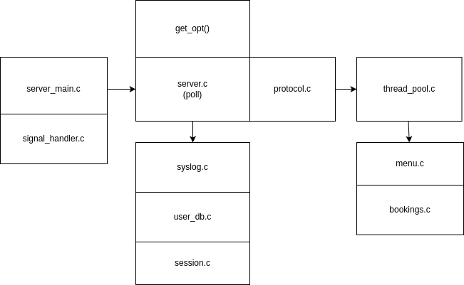

# Exec Summary
We are creating a server-client architecture where the server represents the restaurant's reservation back-end and the client is what customers use to make reservations. They'll communicate over a custom protocol.
# Design (Initial)

# Design (Final) / Control Flow

# Module Relationship 

# Priorities of Work

1. Build the get-opt of the server to run and validate input.
2. Build the base server to run with a poll implementation
3. Build the Thread pool to run concurrency and manage connections
4. Implement the protocol to be able to receive different types of messages.
5. Test, Test, Test.
6. Code cleanup and BARR-C compliance
7. Valgrind and clang-tidy testing.
# Projected Challenges
1. To manage sessions and keep track of users logged on and not for persistence.
2. Implement a thread pool worker correctly.
3. Time management and not to get overwhelmed seeing as this is our most important project in my opinion being a "pre-BSLE" project.